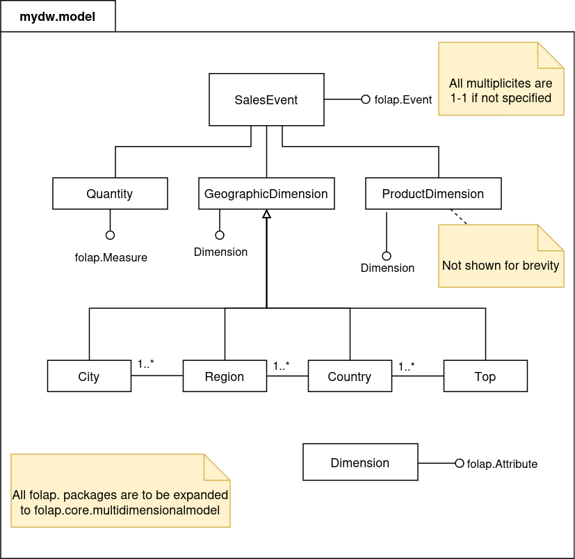

# 04 Design di dettaglio

In primo luogo, si è deciso di operare su degli `Iterable` contenenti gli eventi primari (non aggregati), in modo
da essere flessibili su come questi vengano recuperati dall'utente.

Inoltre, abbiamo deciso di lasciare esprimere all'utente la struttura degli eventi, degli attributi e delle misure.
Questo consente di recuperare agevolmente i valori delle misure e degli attributi.

Per fare questo, abbiamo ipotizzato di definire alcuni `trait` di base (`Event`, `Attribute` e `Measure`) e lasciare
che sia l'utente ad estenderli.

Ci aspettiamo che il modello venga rappresentato nel seguente modo:

Nello specifico, l'utente deve definire le gerarchie corrispondenti alle di mensioni, ed ogni livello della gerarchia
deve avere lo stesso supertipo. Tutti i supertipi (ad es. `ProductDimension` e `GeographicDimension`) devono essere
raggruppati in un `trait` che rappresenta tutte le dimensioni dell'evento, che a sua volta estende il trait `Attribute`
definito dalla nostra libreria.

Questo approccio richiede molta scrittura di codice _boilerplate_, per cui abbiamo deciso di predisporre un DSL atto
alla generazione del codice che definisce gli eventi.

Per come abbiamo implementato il DSL, ci aspettiamo che l'utente strutturi il progetto in un modo simile al diagramma
sottoriportato:

- Un package in cui viene generato il codice
- Un package contenente il codice generato
- Un package contenente la logica di accesso ai dati
- Un package per le query

L'ultimo package potrebbe essere anche un Jupyter Notebook con [spylon kernel](https://github.com/adtech-labs/spylon-kernel)
o uno [Scala Worksheet](https://docs.scala-lang.org/scala3/book/tools-worksheets.html)

